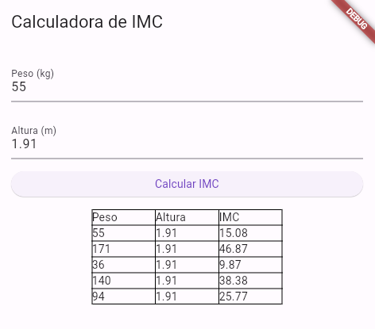

# Armazenando os Dados de IMC e Persistindo Localmente

## Checklist do Desafio

- [x] Criar classe IMC (Peso / Altura)​
- [x] Ler dados no app​
- [x] Calcular IMC ​
- [x] Exibir em uma lista
- [x] Gravar dados no Hive ou SQLite​



## Como rodar:

Execute o comando para gerar o TypeAdapter:

```shell
    $ flutter packages run build_runner build
```

O Hive suporta a versão web, desktop e mobile. Escolha a versão desejada no VSCode ou sua outra IDE ou Terminal e é só rodar.